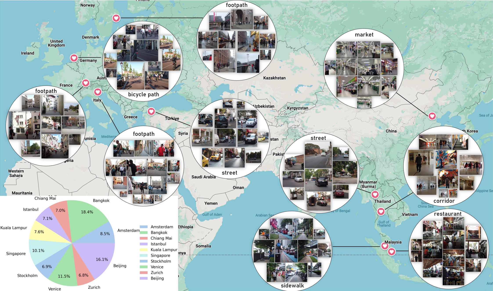
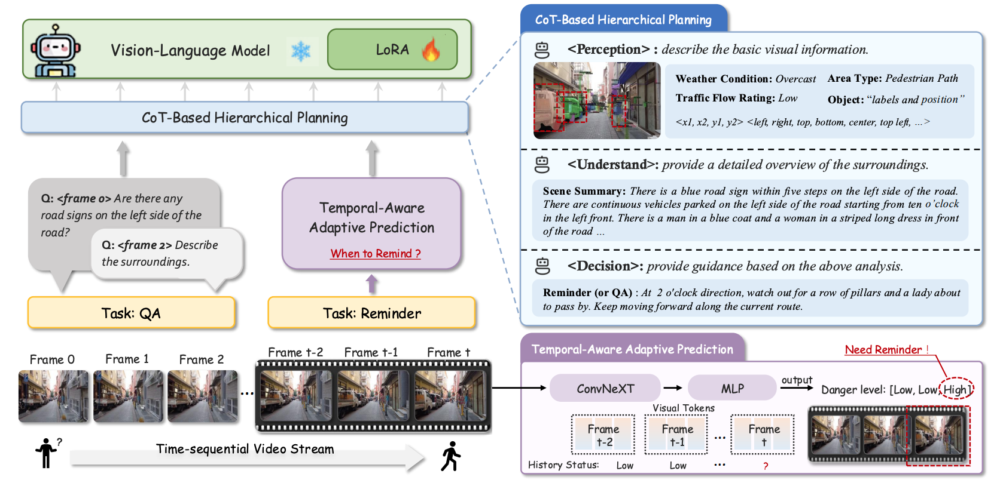

# WalkVLM: Aid Visually Impaired People Walking by Vision-Language Model
<p align="left">
  📄 <a href="https://arxiv.org/pdf/2412.20903" target="_blank"><b>View the Paper</b></a>
</p>

##  🚀 Introduction

Approximately **200 million individuals worldwide** suffer from varying degrees of visual impairment, making it crucial to leverage AI technology to provide **walking assistance**.

With the recent progress of **vision-language models (VLMs)**, applying them for walking guidance has become increasingly popular. However:

- Existing methods are mainly based on **self-curated QA datasets** that are **not publicly accessible**, lacking a **standardized benchmark**.
- Walking assistance often requires **real-time video analysis** and **concise, informative reminders**, but current VLMs struggle due to **long responses** and **low inference efficiency**.

✨ **Our contributions**:
1. We introduce the **first large-scale walking assistance dataset**, comprising **12,000 video–annotation pairs**, serving as a unified benchmark for training and evaluation.
2. We propose **WalkVLM**, which:
   - Employs **chain-of-thought hierarchical planning** to generate concise but informative reminders.
   - Utilizes **temporal-aware adaptive prediction** to reduce redundancy in reminders.
3. We establish a **solid benchmark** for the blind walking task and verify the advantages of WalkVLM in **streaming video processing** compared to other VLMs.

---

<!-- Approximately 200 million individuals around the world suffer from varying degrees of visual impairment, making it crucial to leverage AI technology to offer walking assistance for these people. With the recent progress of vision-language models (VLMs), applying VLMs to offer walking guidance has become popular. However, the existing methods of walking guidance are mainly based on self-curated question-answering datasets that are not publicly accessible, without a standardized benchmark for training or evaluation. Moreover, walking assistance often requires real-time streaming video analysis and the generation of concise yet informative reminders, making VLMs struggle due to excessive responses and low efficiency in inferences. In this paper, we introduce the first large-scale dataset dedicated to walking assistance, comprising 12,000 video-annotation pairs, to provide a unified benchmark for training and evaluating systems to help visually-impaired individuals walk. Furthermore, a WalkVLM model is proposed, which employs chain of thought for hierarchical planning to generate concise but informative reminders and utilizes temporal-aware adaptive prediction to reduce the temporal redundancy of reminders. Finally, we have established a solid benchmark for blind walking task and verified the advantages of WalkVLM in stream video processing for this task compared to other VLMs. -->
## 🛰️ Method & Dataset

<!-- Figure 1 -->
<div align="center">
  
  <div style="width:85%; text-align:justify; margin-top:6px;">
    <b>Fig. 1 —</b> Visualization results of the WAD dataset sorted by region. The WAD dataset has a wide range of sources, and the categories shown are randomly sampled from the dataset. The pie chart in the lower-left corner shows the proportion of video length from different regions.
  </div>
</div>

<!-- Figure 2 -->
<div align="center">
  
  <div style="width:85%; text-align:justify; margin-top:6px;">
    <b>Fig. 2 —</b> An overview of the proposed <i>WalkVLM</i> framework. WalkVLM employs CoT-based hierarchical planning to summarize the static attributes and understanding of scenes, thereby facilitating the subsequent reminder and QA tasks. Furthermore, temporal-aware adaptive prediction has been proposed to calculate the trigger state of VLM, thereby reducing the temporal redundancy of outputs.
  </div>
</div>


## 📂 Code structure

```
.
├── wad_dataset               # Dataset used in WalkVLM
└── WalkVLM-LR                # WalkVLM reasoning code
    ├── checkpoint            # Pretrained weights
    ├── vlm_grpo_template     # GRPO training template
    ├── EAD.py                # EAD model code
    ├── GPTScore.py           # GPTScore calculation code
    ├── inference.py          # Inference script
    ├── test.py               # Testing script
    └── train_EAD.py          # EAD model training script
```

## 📖 Citation
If you feel this code helpful or use this code or dataset, please cite it as
```
Z. Yuan et al., "WalkVLM: Aid Visually Impaired People Walking by Vision Language Model," arXiv preprint arXiv:2412.20903, Dec. 30, 2024.
```
    